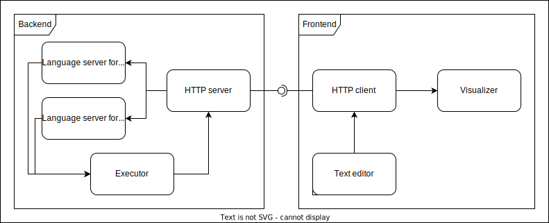

# Architecture plans

The architecture is a 2-tier architecture, with a backend server and a frontend server. The backend server is responsible for handling the data, and the frontend server is responsible for handling the user interface.
The architecture can be seen in the following diagram:

## Backend

The backend handles the incoming requests from the frontend, and passes the incoming data to the language servers. After the language servers have processed it, they send the in-memory objects (the Rubiks cube and the algorithm) to the executor, which executes the algorithm on the cube. The executor then sends the result (the concrete moves, like: U D 2L U') back to the HTTP server, which sends it back to the frontend.

### Technology

The backend will written in Go. It will implement a REST API. The language servers will be based on ANTLR4.

## Frontend

The frontend is a simple application written in Angular. It has a text editor, where the user can edit the cube state description and the algorithm. It also has a viewer, which renders the cube's state. When the user clicks the "Run" button, the frontend sends the data to the backend. After the backend returns the result, the frontend renders the result in the viewer.

### Technology

The frontend will be written in Angular using Typescript.

The cube rendering will be done using a modified version of [this](https://github.com/taylorjg/rubiks-cube) library. If the library will not be licensed, or if the library's functionality will not be sufficient, the rendering will be done using a custom visualizer based on the [three.js](https://threejs.org/) library.

The text editor will be a [Monaco editor](https://microsoft.github.io/monaco-editor/), integrated into a page.

## Running environment

Since the running environment will not be trivial, because the frontend will need a lot of dependencies, the frontend will be packaged into a Docker container. The backend can be compiled into a single executable binary, but it will be packaged into a Docker container as well, for consistency. The two containers will be connected using Docker Compose. 
